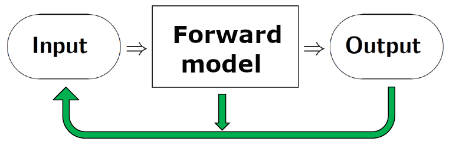

# 2. Inverse problems and ill-posed problems

In the previous parameter-estimation examples we used data to estimate unknown parameters, in order to illustrate important concepts. These are simple examples of inverse problems. CUQIpy is, in fact, written to perform uncertainty quantification for inverse problems, so we should carefully define such problems.

On an abstract level, in a forward problem we use a mathematical model - the **forward model** - to compute the output from a system given the input. This is illustrated by the right-pointing arrows in the figure below. In an **inverse problem** we estimate a quantity that is not directly observable, using the measured output from the system and the model of the forward problem. That is: we use indirect measurements - the output - to determine the input that we cannot directly observe, and which give rise to the data we measure. This is illustrated by the green arrows in the figure below. We cannot solve an inverse problem without a specification of the
forward problem.

<figure>

<figcaption>
</figcaption>
</figure>

CUQIpy includes a number of examples of inverse problems that can be used for illustrations and tests, and a few examples of these will help to illustrate the above concepts. The first three are examples of linear inverse problems where there is a linear relation between the quantity to be estimated and the measured data. In the fourth example this relationship is nonlinear, and it illustrates that uncertainty quantification - and the CUQIpy software - can also handle such problems.

**X-Ray Computed Tomography (CT).** Here we compute images of the interior of an object (or a person) without direct access to the interior. We send X-rays through the object from many directions and on a detector on the opposite side we record the attenuation of the X-rays. Moreover, we have a mathematical formulation of the forward model, consisting of the physics of X-ray attenuation and a specification of the measurement geometry. By solving the inverse problem we obtain information about the interior that helps engineers inspect an object and medical doctors diagnose a patient. X-ray CT problems are illustrated in Chapter {\color{magenta}XX}.

**Image Deblurring.** This problem is sometimes referred to as deconvolution. Here we record an image that is deteriorated by blur, e.g., caused by the lens being imperfect or out of focus. The forward mathematical model gives a precise description of the blurring process, in the form of convolution with a point spread function. When we solve this inverse problem we obtain a sharper image in which the blur has been reduced. For example, this is useful for your holiday snapshots, astronomers can better detect faint objects, and fingerprint scanning can become more reliable. Image deblurring is illustrated in Chapter {\color{magenta}YY}.

**Backward Heat Conduction.** In this inverse problem we identify the initial state of a diffusion process. Specifically, from a measurement of the heat distribution inside an object at time $t=T>0$, compute the heat distribution at time $t=0$, given the forward model of heat conduction inside the object. This forward model is a partial differential equation that expresses the diffusion of heat as time passes. Conceptually, for solving the inverse problem think of running the heat flow "backwards in time." A simple case where the object is a thin rod is illustrated in Chapter {\color{magenta}ZZ}. Many applications of this problem can be found in [WNdB, \S 1.7].

**Inverse Problem for the Poisson Equation.** This is a nonlinear inverse problem whose forward model is a 2D Poisson equation. It is a quite generic problem which can be used to compute, say, the electric conductivity from measurements of an electric potential, thermal conductivity from temperature measurements, or sub-surface
permeability from pore-fluid pressure measurements. In these examples the unknown quantity $\kappa$ is known to be positive, and to enforce this we write it as $\kappa = e^w$; our goal is then to compute the log-conductivity $w = \log\kappa$ (and similar for the other applications). See \S{\color{magenta}OO} for details.

Many inverse problems are ill posed, and for a proper use of CUQIpy it is important to understand this concept because it makes the inverse problem difficult (or impossible) to solve naively. According to Hadamard (see, e.g., [H10, Chapter 1]) a problem is well posed (i) if it has a solution, (ii) if the solution is unique, and
(iii) if small perturbations of the data can only produce small perturbations of the solution. Nowadays we refer to these as the three *Hadamard conditions*.

A problem, then, is **ill posed** if it violates one or more of these Hadamard conditions.Let us discuss this using a linear matrix problem $A\,x = b$, where the right-hand side vector $b$ represents the data, the vector $x$ represents the solution, and the matrix $A$ represents the forward model. These violations can also occur for nonlinear problems.

1. A solution may fail to exist because of noise in the data or due to limitations of the mathematical model, such that it is impossible to find an $x$ that
strictly satisfies the equation $A\, x = b$. Replacing this equation with a data fitting problem, such as the least squares problem $\min_x \| A\, x - b \|_2$, takes care of this condition because such problems always have a solution.
2. A solution may fail to be unique because we do not have enough data (the problem is under-determined). In the case of the system $A\, x=b$ this corresponds to the matrix $A$ having less rows than columns, i.e., there are less equations than unknowns, and there is no unique solution. The same is true if $A$ is rank deficient.
3. Large elements in the solution's covariance matrix $\Sigma$ imply that $x$ is very sensitive to perturbations (e.g., noise) in $b$. This is an intrinsic property of the forward model represented by the matrix $A$, as dictated by the application. For example, this happens if some of the columns of $A$ are linearly dependent (for those familiar with matrix computations, this happens when the condition number of $A$ is large [B].)

There are several ways to deal with these violations of the Hadamard conditions, typically by supplying additional prior information about the solution. This is the topic of the next section.

