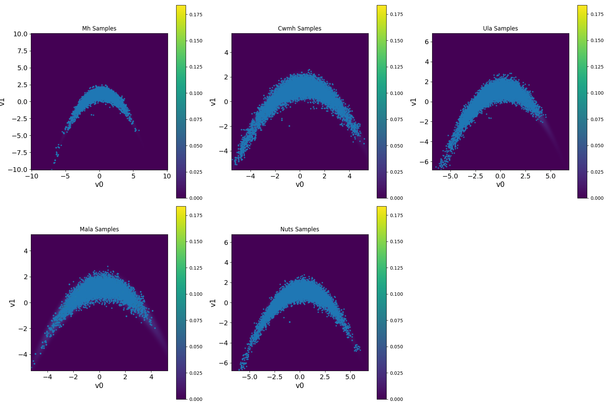

#  CUQIpy benchmarks

Standard benchmarks serve as a valuable tool for comparing and understanding the performance of different UQ methods and implementations in solving Bayesian inverse problems.  We provide a benchmark library, [`CUQIpy-Benchmarks`](https://github.com/CUQI-DTU/CUQIpy-Benchmarks), for researchers and students to test MCMC and optimization methods. This library, contributed by CUQI project graduate interns Tania Andreea Goia and Naoki Sakai, contains a collection of benchmark problems, including linear and nonlinear inverse problems, with varying prior and likelihood choices. Some of these benchmarks are essentially density functions that do not necessarily stem from an inverse problem, but are still useful for testing sampling methods. Examples include the [donut](https://github.com/CUQI-DTU/CUQIpy-Benchmarks/blob/main/demos/D01-donut.ipynb), the [banana](https://github.com/CUQI-DTU/CUQIpy-Benchmarks/blob/main/demos/D02-banana.ipynb), and the [six-modal](https://github.com/CUQI-DTU/CUQIpy-Benchmarks/blob/main/demos/D03-sixmodal.ipynb) density functions. The library also includes actual inverse problems, such as a [2D simple linear inverse problem](https://github.com/CUQI-DTU/CUQIpy-Benchmarks/blob/main/demos/D04-simplest-bip.ipynb), a [heat equation-based problem](https://github.com/CUQI-DTU/CUQIpy-Benchmarks/blob/main/demos/D05-heatstep.ipynb), and a [Poisson equation-based problem](https://github.com/CUQI-DTU/CUQIpy-Benchmarks/blob/main/demos/D06-poisson.ipynb). 

 The benchmarks are designed to be easy to use and extend, with utility methods that simplify applying different sampling methods with different settings, and visualizing and summarizing results.

 An example of how to use the CUQIpy benchmark library is shown below, where we compare the performance of different MCMC methods on the banana-shaped density function benchmark. Note that we use the module `benchmarksClass` for setting up the benchmark problem, and `utilities` for
  running sampling methods and visualizing results.

We first set up the benchmark problem and run different sampling methods with the following code:
 ```python
import utilities 
import benchmarksClass
y = cuqi.distribution.Gaussian(mean=np.array([0, 0]), cov=1)
target_banana = benchmarksClass.Banana()
samples = utilities.MCMCComparison(
    target_banana,
    scale=[1.0, 1.0, 0.065, 0.5, 0.1],
    Ns=8500,
    Nb=1500,
    x0=y,
    seed=12,
    chains=4,
    selected_criteria=["ESS", "AR", "LogPDF", "Gradient", "Rhat"],
    selected_methods=["MH", "CWMH", "ULA", "MALA", "NUTS"])
 ```
 Note that `y` is the distribution from which `MCMCComparison` samples an initial point for each MCMC chain. Then, we can create a comparison table of the MCMC methods' parameters and diagnostics with the following code:
 ```python
 samples.create_comparison()
 ```
This creates a table showing the performance of the tested MCMC methods in terms of effective sample size (ESS), acceptance rate (AR), Rhat diagnostic, number of log-posterior density evaluations (LogPDF), and number of gradient evaluations. It also includes the ratio of log-posterior density evaluations and gradient evaluations per effective sample (LogPDF/ESS) and (Gradient/ESS), respectively. The results are shown in the table below.


 | Metric          | MH      | CWMH   | ULA    | MALA   | NUTS   |
|-----------------|---------|--------|--------|--------|--------|
| samples         | 8500    | 8500   | 8500   | 8500   | 8500   |
| burnins         | 1500    | 1500   | 1500   | 1500   | 1500   |
| scale           | 1.0     | 1.0    | 0.065  | 0.5    | -      |
| ESS(v0)         | 190.945 | 46.069 | 34.643 | 91.406 | 868.884|
| ESS(v1)         | 245.282 | 62.05  | 61.713 | 256.58 | 344.878|
| AR              | 0.374   | 0.615  | 1.0    | 0.512  | 0.911  |
| LogPDF          | 10002   | 20002  | 10002  | 10002  | 80520  |
| Gradient        | 0       | 0      | 10002  | 10002  | 80520  |
| Rhat(v0)        | 1.008   | 1.035  | 1.006  | 1.013  | 1.002  |
| Rhat(v1)        | 1.0     | 1.027  | 1.001  | 1.006  | 1.003  |
| LogPDF/ESS      | 45.857  | 369.999| 207.606| 57.485 | 132.678|
| Gradient/ESS    | 0.0     | 0.0    | 207.606| 57.485 | 132.678|

And to plot the results, we can use the following code:
```python
 samples.create_plt()
```
 <figure>

<figcaption>Figure 1. Results for sampling the banana-shaped density function benchmark using different MCMC methods.
</figcaption>
</figure>

The link to the benchmarks library, which includes more examples, can be found in the resources section below.

## Resources
- CUQIpy benchmarks GitHub repository: https://github.com/CUQI-DTU/CUQIpy-Benchmarks