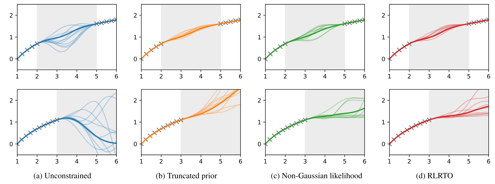
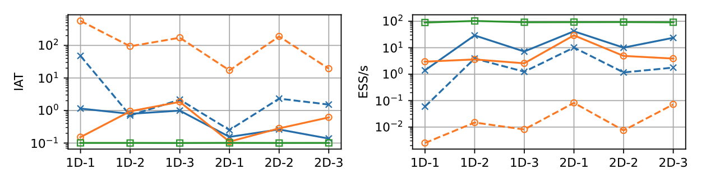

# Efficient monotonic Gaussian processes via Randomize-then-Optimize

## Summary

Gaussian Processes (GPs) constitute a robust Bayesian framework for non-parametric function approximation, distinguished by their modeling flexibility and principled uncertainty quantification. Historically rooted in geostatistical kriging, GPs have gained significant traction across machine learning, global optimization, and reliability analysis. Their capacity to construct high-fidelity surrogate models is particularly indispensable in scientific and engineering domains where empirical data is either sparse or prohibitively expensive to acquire. In this work, {cite}`Zhang2026efficient`, we address the computational intractability of integrating monotonicity constraints into GP frameworks, proposing accelerated methodologies to enhance predictive fidelity in the modeling of physical systems.

In many applications, prior knowledge about the function to be approximated is available, often as physical constraints like boundedness, monotonicity, or convexity. These constraints arise from fundamental principles; for example, chemical concentrations must remain non-negative, and temperatures are confined to monotonic relationships with respect to inputs like pressure or time. Incorporating such constraints into GP models improves predictive accuracy by aligning with known physical laws, reduces uncertainty by excluding infeasible solutions, and enhances data efficiency, which is critical in data-limited settings.

The virtual point method is a popular way to add constraints to the process of building a GP model but it is relatively expensive to implement as it boils down to sampling from a constrained posterior distribution, usually through Markov Chain Monte Carlo (MCMC). The computational burden escalates in high-dimensional settings, where the number of virtual points or basis functions grows drastically. For example, the commonly used component-wise Gibbs sampler in virtual point-based methods updates variables sequentially, leading to slow convergence when the number of virtual points is large or when variables are highly correlated.

In this paper, after reviewing two established virtual point-based methods, namely truncated prior and non-Gaussian likelihood approaches, we propose a novel approach leveraging the Regularized Linear Randomize-then-Optimize (RLRTO) method for efficient sampling of a constrained posterior distribution of the derivative GPs at virtual points. The different behaviors of the unconstrained, truncated prior, non-Gaussian likelihood and our method are illustrated in Figure 1.

<figure>

<figcaption>Figure 1. Constrained GPs and unconstrained GPs for an illustrative 1D example. The top row corresponds to interpolation and the bottom row corresponds to extrapolation. The shaded regions represent the areas where training data are absent.
</figcaption>
</figure>

In this plot, we examine two typical cases: interpolation within the training data range but with a gap where no training data is available (first row), and extrapolation beyond the training data range (second row). Even though the training data are monotonic, the unconstrained GP shows undesirable behavior and many of its samples violate the monotonicity in both cases. In contrast, all three constrained GPs successfully enforce the monotonicity constraint in both cases. Particularly, the non-Gaussian likelihood and our method permit flat regions in the samples.

At implementation, we make use of `cuqi.sampler.RegularizedLinearRTO` with the non-negativity constraint. Specifically, we use the L-BFGS-B algorithm to solve the constrained linear least squares problems and each solve leads to an independent sample from the target distribution.

<figure>

<figcaption>Figure 2. Integrated autocorrelation time (IAT) and effective samples per second (ESS/s) across six experiments. Green denotes our RLRTO method; solid/dashed blue denote the truncated prior method with NUTS/Gibbs; solid/dashed orange denote the non-Gaussian likelihood method with NUTS/Gibbs.
</figcaption>
</figure>

We provide extensive experiments and detailed comparisons of our method with established virtual point-based methods in the paper. In particular, we want to highlight that our RLRTO method stands out for its computational efficiency. As shown in Figure 2, RLRTO achieves the lowest integrated autocorrelation time (IAT) and the highest effective samples per second (ESS/s) among all evaluated methods. The proposed method is particularly useful for applications where monotonicity constraints are important, such as in optimization and decision-making problems.

## Resources
- Paper: {cite}`Zhang2026efficient`
- Paper code GitHub repository: https://github.com/CUQI-DTU/Paper-FMGP