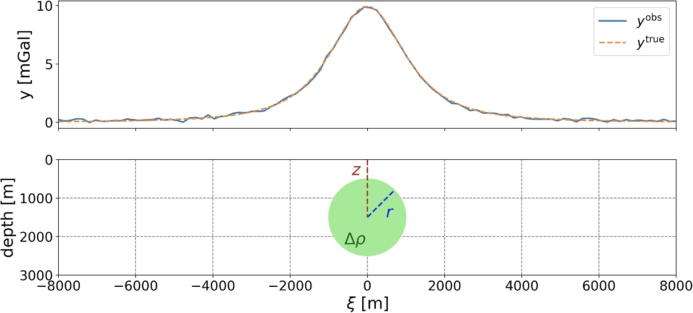
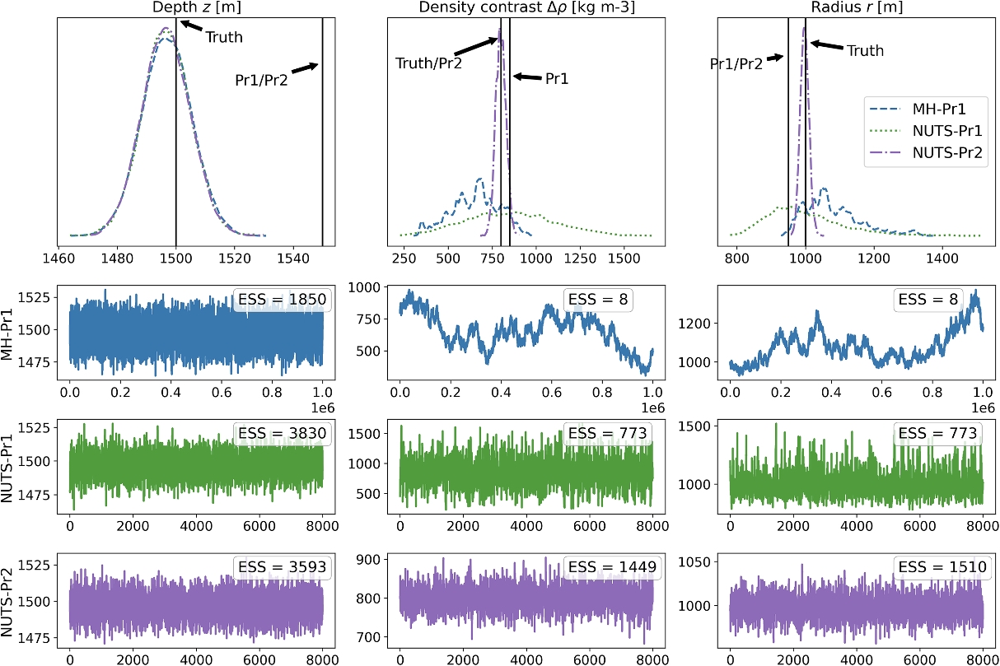

# CUQIpy – I. Computational uncertainty quantification for inverse problems in Python

## Summary

We published a two-part series introducing CUQIpy to the inverse problems research community, {cite}`Riis_2024` and {cite}`Alghamdi_2024`. The first focuses on the general framework of CUQIpy, with many examples of its use for general inverse problems, while the second focuses on the framework and applications of CUQIpy for PDE-based inverse problems.

In the first part, we provide a background on Bayesian inverse problems and an overview of the sampling methods implemented in CUQIpy. We illustrate the intuitive near-mathematical syntax of CUQIpy via a 1D deblurring example and list and define the key components and classes in CUQIpy. We present a range of examples demonstrating the use of CUQIpy for various types of inverse problems, including linear and nonlinear problems, simple and  hierarchical Bayesian models. The examples cover a range of applications, including image deblurring, parameter estimation, computed tomography, and the classic Eight Schools problem in Bayesian statistics. The latter two examples showcase the use of CUQIpy with our CUQIpy-CIL and CUQIpy-PyTorch plugins, respectively.

We present here one example from the paper, in which we use CUQIpy to determine the parameters of a subsurface spherical body that causes a gravity anomaly detected at the surface. These parameters are the radius $r$, depth $z$, and density contrast $\Delta \rho$ of the body with respect to the background. We show in Figure 1 the detected anomaly at the surface and the buried body causing it. In Figure 2, we show the results of sampling the posterior distribution of the parameters using different priors and samplers. Note that the NUTS sampler outperforms the Metropolis–Hastings sampler in terms of convergence and mixing, and using a strong prior for $\Delta\rho$ further improves the results. This example demonstrates the importance of choosing appropriate sampling methods and priors in Bayesian inverse problems to achieve accurate and efficient inference.

The link to the code for all examples in the paper is provided in the resources section below.

<figure>

<figcaption>Figure 1. Top: Simulated measured gravity anomaly with noise and true gravity anomaly. Bottom: Buried spherical body causing the gravity anomaly at the surface.
</figcaption>
</figure>

<figure>

<figcaption>Figure 2. Trace plots of posterior samples using different priors: an uninformative prior (Pr1) in combination with the Metropolis–Hastings and NUTS samplers, a strong prior for the density contrast  (Pr2) in combination with the NUTS sampler. The top row shows the 1D marginals of the posterior distributions with the prior and true parameter values marked with black vertical lines. Rows 2–4 show the chains of the samples and respective effective sample sizes that are computed for each chain.
</figcaption>
</figure>

## Resources
- Paper: {cite}`Riis_2024`
- Paper code GitHub repository: https://github.com/CUQI-DTU/Paper-CUQIpy-1-Core