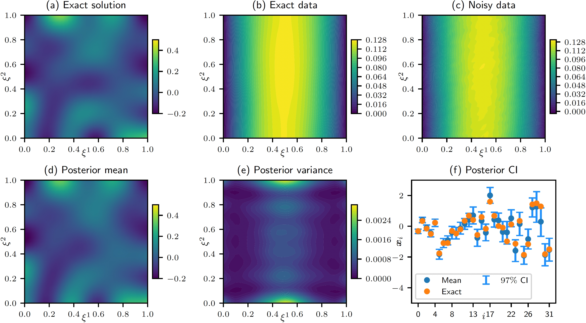

# CUQIpy – II. Computational uncertainty quantification for PDE-based inverse problems in Python

## Summary

Inverse problems governed by Partial Differential Equations (PDEs) are prevalent in various scientific and engineering applications, and uncertainty quantification (UQ) of solutions to these problems is essential for informed decision-making. In the second part of our two-paper series {cite}`Alghamdi_2024`, we build upon the foundation set by the first part {cite}`Riis_2024`,  extending CUQIpy's capabilities to solve PDE-based Bayesian inverse problems through a general framework that allows the integration of PDEs, whether expressed natively or via third-party libraries such as FEniCS. 

The versatility and applicability of CUQIpy to PDE-based Bayesian inverse problems are demonstrated on examples covering parabolic, elliptic, and hyperbolic PDEs. This includes problems involving the heat and Poisson equations and application case studies in electrical impedance tomography (EIT) and photo-acoustic tomography (PAT), 
showcasing the software's efficiency, consistency, and intuitive interface. Throughout the paper, we present CUQIpy framework for PDE-based inverse problems, its main components and classes, and the CUQIpy-FEniCS plugin, which we use in the Poisson, EIT, and PAT examples.

We present here the results from the Poisson problem example in the paper, Figure 1. In this example, we use CUQIpy to infer the log-conductivity field (a) of a two-dimensional medium from noisy observations of the temperature everywhere in the domain (c). We use a truncated KL expansion-based prior to represent the log-conductivity field. Inference is performed on the KL coefficients, and the results are mapped back to the log-conductivity field using the KL expansion. The results in (d) and (e) show the mean and variance of the inferred log-conductivity field, respectively, computed from the posterior samples. The confidence interval (CI) plot in (f) shows the $97\%$ CIs for the KL coefficients and their mean computed from the posterior samples, as well as the exact KL coefficients. We note that the exact KL coefficients are within the CIs, and the inferred field (c) is very close to the exact field (a). These results were obtained using the NUTS sampler.

<figure>

<figcaption>Figure 1. Results for the 2D Poisson problem, (a) the exact solution, (b) the exact data, (c) the observed noisy data (1% noise level), (d) the inferred log-conductivity field, (e) the inferred log-conductivity variance, and (f) the CI plot for the KL coefficients (blue vertical lines), the exact KL coefficients (orange circles), and the KL coefficients posterior-means (blue circles).
</figcaption>
</figure>

The link to the code for all examples in the paper is provided in the resources section below.

## Resources
- Paper: {cite}`Alghamdi_2024`
- Paper code GitHub repository: https://github.com/CUQI-DTU/Paper-CUQIpy-2-PDE